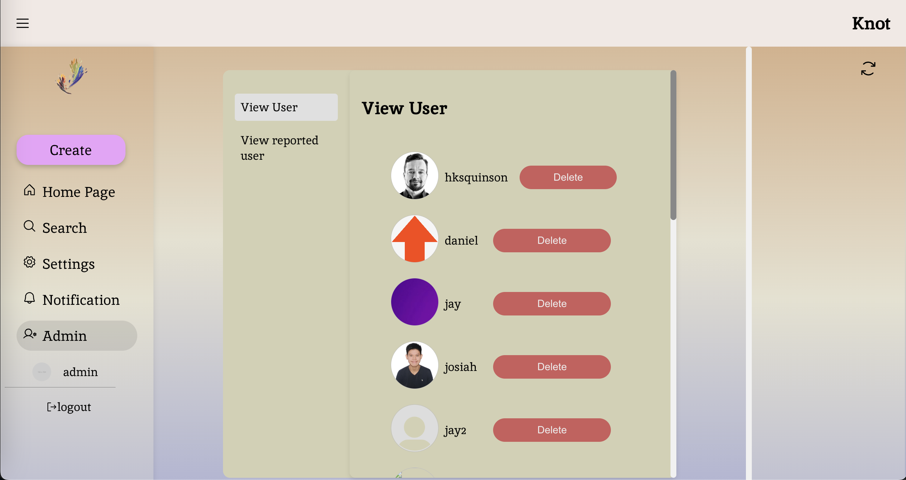

# Knot - Weaving Stories, Building Communities

Knot is a community-oriented social platform designed to foster connections and interactions among users through story sharing and community building. The application allows users to create, follow, comment, and manage posts within a supportive environment.

## Project Description

### What does the project do?

Knot provides a platform for users to:

- Register and manage user accounts.
- Follow other users and manage follow requests.
- Create, edit, and comment on posts.
- Search for users and content.
- Administer user activities and content (Admin roles).

### Future Implementations

- Enhanced user settings.
- Improved security features.
- Improved search functionality.

## Installation and Running the Project

### Prerequisites

Ensure you have Node.js and npm installed:

```bash
node --version
npm --version
```

### Installation

Clone the repository:

```bash
git clone https://github.com/hanjihun2000/knot-csci3100-project.git
cd knot-csci3100-project
```

Install dependencies:

```bash
cd client
npm install
cd server
npm install
```

### Setting Up the Database

1. Create a MongoDB Atlas database.
2. Create a `.env` file in the `server` directory.
3. Add the following environment variables:

```bash
export ATLAS_URI=your_mongo_uri
```

### Running the Application

To run the server:

```bash
cd client
npm start
cd server
npm start
```

Access the application at `http://localhost:3000`.

## How to Use the Project

### Getting Started

#### 1. Creating an Account

To start using Knot, you'll need to create an account:

- Navigate to the Sign-up page.
- Enter your email address, choose a username, and set a secure password.
- Read the terms and conditions.
- Click the "Sign up" button to create your account.
- If you already have an account, click the "Click here to log in" link.


#### 2. Logging In

Once you have an account:

- Go to the Login page.
- Enter your username and password.
- Click the "log in" button to access your account.


### Using Knot

#### 3. Main Navigation

After logging in, you'll be taken to the main interface where you can:

- Click "Create" to make a new post.
- Use the "Home Page" to view recent activity and posts.
- The "Search" feature helps you find specific users.
- "Settings" allow you to adjust your account preferences.
- Check "Notification" for recent alerts.
- The "Logout" button lets you sign out securely.


#### 4. Creating a Post

To share your thoughts or content:

- Click the "Create" button on the main menu.
- Type your post content into the text area provided.
- Attach photos if desired by clicking "Attach Photo."
- Click "Create Post" to publish your post.


#### 5. Interacting with Posts

Engage with the community by:

- Using the like and dislike buttons to react to posts.
- Type in the text box and click "Comment" to leave a response on posts you find interesting.


#### 6. Editing Your Profile

To update your profile information:

- Navigate to "Settings" and select "Edit Profile."
- From here, you can change your profile picture, update your username, and modify your password.
- Click "Confirm" after making your changes to save them.


#### 7. Viewing Profile Pages

To view a user's profile:

- Click on a username anywhere within the platform.
- This will take you to their profile page where you can see their posts, followers, and whom they are following.
- You can also view their profile picture and personal bio if they've added one.


#### 8. Sending and Receiving Follow Requests

##### Sending a Follow Request

- On a user's profile page, click the "Follow" button to send them a follow request.
- If their account is public, you'll follow them immediately. If their account is private, they will receive a follow request.

##### Receiving a Follow Request

- When someone sends you a follow request, you will receive a notification.
- Navigate to the "Notification" tab from the main menu.
- Here you will see all your follow requests along with other notifications.
- You can choose to "accept" or "reject" the follow request.


#### 9. Admin Features

If you have admin privileges:

- Access the "Admin" section from the main menu.
- Here you can view reported users, delete posts, and manage the community.



Enjoy connecting and sharing with the Knot community!

## Admin Credentials

To access admin functionalities, please create a login account through MongoDB with the following credentials:

- Username: `'admin'`
- Password: (your choice)
- accountType: `'admin'`

## Collaborators

- [Cheng Chung Hei Sennett](https://github.com/sennettcheng)
- [Hon Kwan Shun Quinson](https://github.com/hksquinson)
- [Daniel Sharjil Huq](https://github.com/DanielSHuq)
- [HAN Jihun](https://github.com/hanjihun2000)
- [Josiah Olyver Lee Yong Zhi](https://github.com/josiahleee)

## License

This project is licensed under the MIT License - see the [LICENSE.md](LICENSE) file for details.

## Acknowledgments

- [MongoDB](https://www.mongodb.com/)
- [Express](https://expressjs.com/)
- [React](https://reactjs.org/)
- [Node.js](https://nodejs.org/)

Generative AI tools used for code writing:

- [GPT-4](https://www.openai.com/gpt-4/)
- [Claude 3](https://www.anthropic.com/claude)
